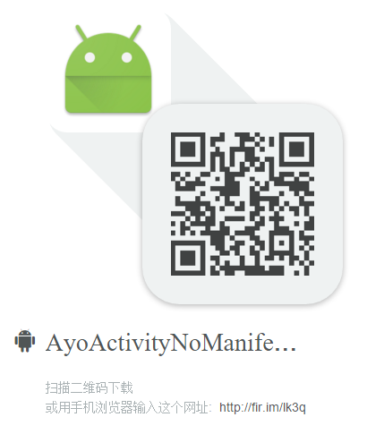

# AyoActivityNoManifest
A light tool sdk include: Activity without 声明 in manifest，SystemBar一体化，Activity和Frament状态存储


###
###

demo apk  




## 1 这是什么？  

* 这个库提供了：
    * 一个轻量级的Activity代理框架（ActivityAttacher，使用方式基本和Activity一样），目的在于不必在Manifest反复声明Activity
    * 同时提供了一个轻量级的Bundle机制（SimpleBundle，使用方式基本和Bundle一样），目的在于在Activity之间传递参数时考虑序列化问题，适用于进程内通信
    * 提供了一个轻量级的OnActivityResult机制（OnResultCallback，使用方式基本和OnActivity不一样)
    * 状态栏一体化的简单封装
    * Activity和Fragment状态保存的问题
    * 其他Activity和Fragment问题的解决方案，后期一个一个加


## 2 ActivityAttacher的使用


### (1) manifest


在gradle里引入：`compile 'org.ayo:attacher:1.0.0'`


* manifest里只需要声明：
    * 主Activity
    * 有特殊需求的Activity，如支持旋转
    * 模板Activity，暂时只支持一个启动模式对应一个模板Activity
    * 模板Activity有几个默认配置项，如果需要更改，也需要声明自己的Activity


__Manifest中的声明：__

```Java
<activity
            android:name="com.cowthan.sample.MainActivity"
            android:configChanges="orientation|screenSize|keyboardHidden|navigation"
            android:screenOrientation="portrait"
            android:theme="@style/AppTheme"
            >
            <intent-filter>
                <action android:name="android.intent.action.MAIN" />

                <category android:name="android.intent.category.LAUNCHER" />
            </intent-filter>
        </activity>

        <activity
            android:name="org.ayo.app.base.TmplActivityStandard"
            android:configChanges="orientation|screenSize|keyboardHidden|navigation"
            android:screenOrientation="portrait"
            android:launchMode="standard"
            android:theme="@style/AyoTransparentTheme" />

        <activity
            android:name="org.ayo.app.base.TmplActivitySingleTask"
            android:configChanges="orientation|screenSize|keyboardHidden|navigation"
            android:screenOrientation="portrait"
            android:launchMode="singleTask"
            android:theme="@style/AyoTransparentTheme" />

        <activity
            android:name="org.ayo.app.base.TmplActivitySingleTop"
            android:configChanges="orientation|screenSize|keyboardHidden|navigation"
            android:screenOrientation="portrait"
            android:launchMode="singleTop"
            android:theme="@style/AyoTransparentTheme" />

        <activity
            android:name="org.ayo.app.base.TmplActivitySingleInstance"
            android:configChanges="orientation|screenSize|keyboardHidden|navigation"
            android:screenOrientation="portrait"
            android:launchMode="singleInstance"
            android:theme="@style/AyoTransparentTheme" />
```


### (2) ActivityAttacher

* ActivityAttacher的意义：
    * ActivityAttacher就是附着在上面4个模板Activity里的Activity代理
    * ActivityAttacher中持有一个Activity实例对象，是在onCreate时赋值的
    * ActivityAttacher可以处理Activity中的所有配置和生命周期
    * ActivityAttacher提供的接口，原则上应该完全仿Activity，这一点类似v7源码中的和AppCompactActivity相关的一个delegate类，但不知道这个类是干什么用的

### (3) 定义Activity

看代码，这两个只有基类不一样，内部代码应该是一样的，其中继承AyoActivity的是一个普通Activity，需要去manifest声明，
而继承AyoActivityAttacher，就不需要再去manifest声明了

```Java
public class SampleActivity extends AyoActivityAttacher{

    public static void start(Context c, boolean takeSystemBar, int lanuchMode, OnResultCallBack callBack){
        SimpleBundle sb = new SimpleBundle();
        sb.putExtra("takeSystemBar", takeSystemBar);
        ActivityAttacher.startActivity(c, SampleActivity.class, sb, false, lanuchMode, callBack);
    }

    @Override
    protected void onCreate(Bundle savedInstanceState) {
        super.onCreate(savedInstanceState);
        setContentView(R.layout.ac_tmpl);
    }
}

public class SampleActivity extends AyoActivity{

    @Override
    protected void onCreate(Bundle savedInstanceState) {
        super.onCreate(savedInstanceState);
        setContentView(R.layout.ac_tmpl);
    }
}
```

### (4) 启动ActivityAttacher

启动方式变成这样：
```java
public static void start(Context c, boolean takeSystemBar, int lanuchMode, OnResultCallBack callBack){
    SimpleBundle sb = new SimpleBundle();
    sb.putExtra("takeSystemBar", takeSystemBar);
    ActivityAttacher.startActivity(c, SampleActivity.class, sb, false, lanuchMode, callBack);
}
```

* SimpleBundle：功能类似于intent或者bundle，存的是传到下一个Activity的参数
    * 取出参数：`boolean takeSystemBar = getIntent().getBooleanExtra("takeSystemBar");`
    * 这里，在Activity之间传的都是引用，不再需要考虑序列化问题，当然只适用于app单进程内
* OnResultCallBack是接收Activity的回传结果
    * 如何回传：`getResultCallback().onResult("代替OnActivityReslt和setResult"); finish();`
* lanuchMode是选择Activity的启动模式，也就是选择模板：
    * ActivityAttacher.LAUNCH_MODE_STANDARD
    * ActivityAttacher.LAUNCH_MODE_SINGLE_TASK
    * ActivityAttacher.LAUNCH_MODE_SINGLE_TOP
    * ActivityAttacher.LAUNCH_MODE_SINGLE_INSTANCE

### （5） Activity主题

这里提供了两个主题：AyoTransparentTheme和AyoTheme，没啥特殊的


## 3 状态栏一体化问题


问题1：颜色设置，可以开启和关闭，分status bar和navigation bar  

问题2：是否侵入，可以开启和关闭，和颜色设置不冲突

代码：
```java
@Override
protected void onCreate(Bundle savedInstanceState) {
    super.onCreate(savedInstanceState);
    setContentView(R.layout.sample_ac_main);

    //关闭StatusBar和NavigationBar侵入
    getAgent().enableSystemBarTakenByContent(false);

    //给StatusBar和NavigaionBar染色
    getAgent().renderSystemBar(Color.parseColor("#55ff0000"), Color.parseColor("#55ff0000"));

}

```

* 解析：
    * 这里就是对开源代码SystemBarTintManager的简单封装
    * enableSystemBarTakenByContent其实就是设置根布局的`android:fitsSystemWindows`属性


fitSystemWindows是true时：enableSystemBarTakenByContent(false)，内容给SystemBar留空


fitSystemWindows是false时：enableSystemBarTakenByContent(true)，内容侵入SystemBar


## 4 状态保存问题

https://github.com/frankiesardo/icepick

## 5 其他

关于clipToPadding和clipToChildren：默认都为true
http://www.jcodecraeer.com/a/anzhuokaifa/androidkaifa/2015/0317/2613.html

好像和滚动有关，可以上下滚动时，内容是否可以滚动到标题栏里

```
<ListView
    android:layout_gravity="center_vertical"
    android:id="@+id/list"
    android:clipChildren="false"
    android:clipToPadding="false"
    android:paddingTop="50dip"
    android:layout_width="match_parent"
    android:layout_height="match_parent" />
```

ListView初始化之后，由于top的50dp的padding，看似顶着标题栏，但往上滚动时，内容就会跑到padding的50dp里，也就能从标题栏看到了（如果标题栏带透明）